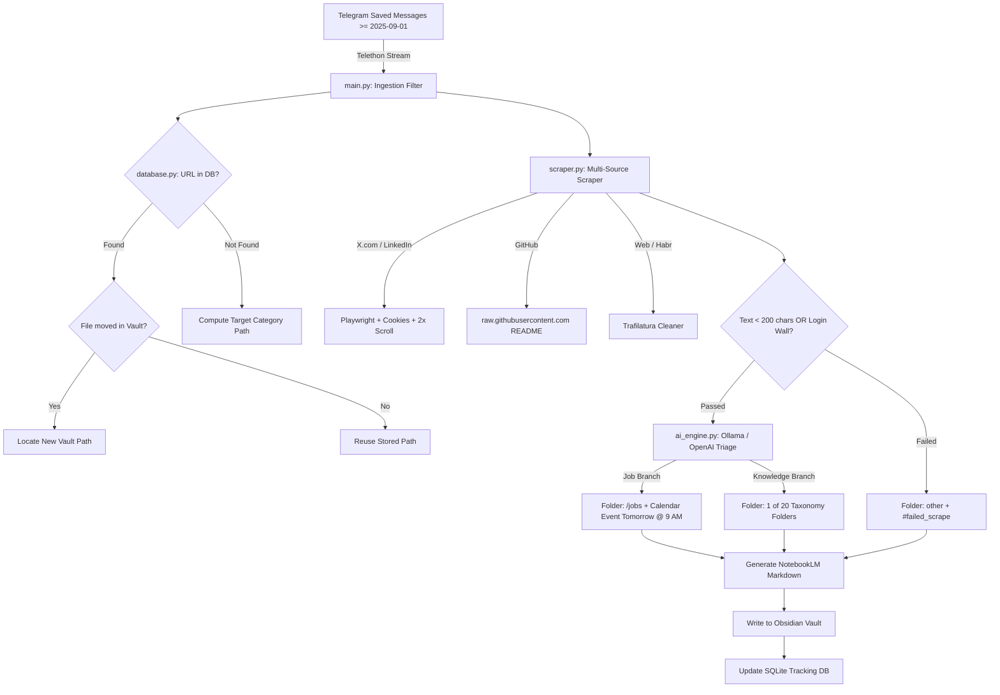

# Librarian AI

Personal Intelligence ETL (Extract, Transform, Load) pipeline that monitors your **Telegram "Saved Messages"**, scrapes web sources (X/Twitter, LinkedIn, GitHub, Habr, tech blogs), triages content into **Job Opportunities** or **Knowledge (20 Obsidian folders)**, and generates structured, **NotebookLM-ready Markdown notes** in your Obsidian Vault with **Smart Overwrite** tracking and **Google Calendar** integration.

---

## Architecture & Workflow



---

## Key Features

1. **Telegram Ingestion Filter**:
   - Streams Telegram "Saved Messages" using Telethon.
   - Automatically filters for messages containing URLs dated **>= September 1, 2025**.
2. **Smart Overwrite Engine**:
   - Tracks all processed URLs and their file paths in SQLite (`processed_links.db`).
   - If you move a note to a different folder in Obsidian (e.g. from `/drafts` to `/agents`), Librarian AI scans frontmatter URLs and updates the note in-place instead of creating duplicates like `Title (1).md`.
3. **Multi-Source Scraping**:
   - **X.com / LinkedIn**: Automated Playwright scraper with cookie injection (`cookies.json`) and double-scroll to capture full threads and dynamic replies without context loss.
   - **GitHub**: Automatically converts repository links to raw `README.md` content via `raw.githubusercontent.com`.
   - **Technical Articles & Habr**: Clean HTML parsing and text extraction via Trafilatura.
   - **Integrity Guardrail**: Detects login walls and text < 200 characters, tagging them with `#failed_scrape` and routing to the `other` folder without polluting summaries.
4. **AI Librarian Triage**:
   - **Job Branch**: Detects job postings (`linkedin.com/jobs` or hiring text), saves note to `/jobs`, and schedules a review event in **Google Calendar (Tomorrow @ 9:00 AM)**.
   - **Knowledge Branch**: Classifies into exactly one of **20 taxonomy folders**:
     `research`, `agents`, `workflows`, `ML`, `big_data`, `trading`, `jobs`, `ideas`, `resources`, `drafts`, `repositories`, `tools`, `rules`, `policy`, `cases`, `issues`, `literature`, `hooks`, `hints`, `other`.
   - **Russian Translation**: Automatically translates Russian sources (Habr, etc.) to English AI Summaries and English tags.
   - **NotebookLM Metadata**: Injects YAML frontmatter (`url`, `date`, `category`, `type`) with clean markdown formatting.
5. **Local / Cloud AI Toggle**:
   - Defaults to local **Ollama** (`http://localhost:11434` with `llama3:8b` or `mistral`).
   - Switchable to OpenAI **GPT-4o** via `USE_OPENAI=true` in `.env`.

---

## Project Structure

```
/telelibra
├── main.py              # Batch trigger & Telegram stream orchestrator
├── database.py          # SQLite persistence & Smart Overwrite vault relocation
├── scraper.py           # Playwright/Trafilatura logic & integrity checks
├── ai_engine.py         # Prompt engineering, LLM routing & NotebookLM generator
├── calendar_util.py     # Google Calendar OAuth & Event creation (Tomorrow @ 9 AM)
├── config.py            # .env management & 20-Folder Taxonomy definitions
├── utils.py             # Decorators (@measure_performance, @retry), helpers
├── cookies.json         # Browser cookies for authenticated X / LinkedIn scraping
├── Dockerfile           # Playwright-heavy Docker container
├── docker-compose.yml   # Volume mapping for Obsidian Vault & Ollama gateway
├── requirements.txt     # Python dependencies
├── pyproject.toml       # Project metadata & test configs
└── .env.example         # Template environment configuration
```

---

## Step-by-Step Configuration Guide

### 1. Prerequisites
- **Python 3.11+** installed locally (or Docker).
- **Telegram API Credentials**:
  1. Visit [https://my.telegram.org](https://my.telegram.org) and log in.
  2. Go to **API development tools** and create an app.
  3. Copy your `api_id` and `api_hash`.
- **AI Engine**:
  - **Local (Default)**: Install and start [Ollama](https://ollama.ai) (`ollama run llama3:8b`).
  - **Cloud**: Obtain an OpenAI API key from [platform.openai.com](https://platform.openai.com).

### 2. Environment Variables (.env)
Copy `.env.example` to `.env`:
```bash
cp .env.example .env
```

Configure your parameters in `.env`:
```ini
# Telegram Credentials
TELEGRAM_API_ID=12345678
TELEGRAM_API_HASH=your_telegram_api_hash_here
TELEGRAM_PHONE=+1234567890
TELEGRAM_SESSION_NAME=librarian_session

# Storage & Vault Paths
DATABASE_PATH=processed_links.db
OBSIDIAN_VAULT_PATH=./vault
COOKIES_PATH=cookies.json

# Local Ollama Settings (Default)
USE_OPENAI=false
OLLAMA_BASE_URL=http://localhost:11434
OLLAMA_MODEL=llama3:8b

# Cloud OpenAI Settings (Optional)
# USE_OPENAI=true
# OPENAI_API_KEY=sk-proj-your_key_here
# OPENAI_MODEL=gpt-4o

# Scraping Settings
PLAYWRIGHT_HEADLESS=true
SCRAPE_TIMEOUT_MS=30000

# Google Calendar Integration (Optional)
GOOGLE_CALENDAR_CREDENTIALS=credentials.json
GOOGLE_CALENDAR_TOKEN=token.json
```

### 3. Cookies Configuration for X.com / LinkedIn (Optional)
To scrape private threads or avoid rate limits on X.com and LinkedIn, export your browser cookies into `cookies.json`:
```json
[
  {
    "name": "auth_token",
    "value": "YOUR_X_AUTH_TOKEN",
    "domain": ".x.com",
    "path": "/",
    "httpOnly": true,
    "secure": true
  },
  {
    "name": "li_at",
    "value": "YOUR_LINKEDIN_LI_AT",
    "domain": ".linkedin.com",
    "path": "/",
    "httpOnly": true,
    "secure": true
  }
]
```

### 4. Google Calendar OAuth Setup (Optional)
If you want job opportunities to be scheduled for review tomorrow at 9:00 AM:
1. Enable Google Calendar API in Google Cloud Console.
2. Download OAuth Client credentials as `credentials.json` into the project root.
3. On first job event creation, a browser window will open to authorize calendar access.

---

## How to Run

### Method A: Run Locally

1. **Install Dependencies & Playwright Browser**:
```bash
pip install -r requirements.txt
playwright install chromium
```

2. **Test a Single URL (Direct Mode)**:
```bash
python main.py --url "https://github.com/microsoft/autogen"
```

3. **Dry-Run Mode (No Files Written)**:
```bash
python main.py --url "https://habr.com/ru/articles/78910/" --dry-run
```

4. **Run Full Telegram Batch Scanner**:
```bash
# Scans Saved Messages from September 1, 2025:
python main.py

# Optional: specify custom start date or message limit:
python main.py --since 2025-09-15 --limit 50
```

---

### Method B: Run with Docker Compose

1. Ensure Ollama is running on your host machine.
2. Build and start the container:
```bash
docker-compose up --build
```
Your notes will automatically appear in your local `./vault` directory, categorized across the 20 taxonomy folders.

---

## 20-Folder Taxonomy Guide

| Folder | Definition |
|---|---|
| `research` | Academic papers, scientific studies, theoretical analysis |
| `agents` | Autonomous AI systems, multi-agent frameworks, LLM orchestrators |
| `workflows` | Business processes, automation sequences, pipeline architectures, CI/CD |
| `ML` | Machine learning models, neural networks, fine-tuning, training |
| `big_data` | Distributed data processing, Spark, Kafka, data lakes, ETL |
| `trading` | Financial algorithms, quantitative analysis, crypto, economics |
| `jobs` | Job postings, recruitment opportunities, vacancy specs |
| `ideas` | Inventions, product concepts, brainstorming notes, startup ideas |
| `resources` | Curated lists, cheatsheets, dataset links, public APIs |
| `drafts` | Incomplete writings, work-in-progress blogs, rough notes |
| `repositories` | Open source GitHub/GitLab repositories, code libraries |
| `tools` | Developer utilities, software applications, SaaS products, CLI tools |
| `rules` | Coding standards, linting rules, architectural constraints |
| `policy` | Legal terms, governance guidelines, AI safety policies |
| `cases` | Real-world case studies, industry post-mortems, incident reviews |
| `issues` | Technical bugs, troubleshooting logs, known CVEs, defects |
| `literature` | Books, essays, long-form journalism, philosophical pieces |
| `hooks` | Event triggers, webhooks, integration callbacks, signals |
| `hints` | Quick tips, shortcuts, performance hacks, hidden features |
| `other` | Miscellaneous links, failed scrapes, login walls |

---

## Running Tests

Run the complete test suite:
```bash
pytest -v
```
All unit and integration tests verify Smart Overwrite path resolution, scraping integrity, AI triage, and Google Calendar event formatting.
