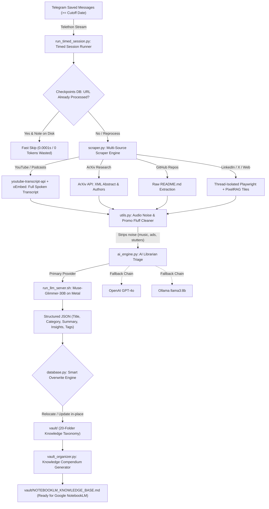

# Telelibra — Personal Intelligence ETL Pipeline 🧠📚

> **Turn your Telegram "Saved Messages" link graveyard into an organized, noise-free Obsidian Second Brain & Google NotebookLM Knowledge Base.**

**Telelibra** is an autonomous Personal Intelligence ETL (Extract, Transform, Load) pipeline designed for continuous knowledge synthesis, technical research, and personal intelligence management.

---

## 🎯 The Problem & The Vision

### The Problem:
Every active developer, researcher, and knowledge worker saves dozens of links every week into Telegram **"Saved Messages"** — YouTube podcasts, ArXiv papers, GitHub repositories, deep-dive LinkedIn articles, and X (Twitter) threads. Over months, this becomes an unsearchable **"digital clutter graveyard"** where valuable knowledge is lost and never revisited.

### The Solution:
**Telelibra** continuously monitors your Telegram Saved Messages, extracts the full source content (including **complete YouTube audio speech-to-text transcripts**, ArXiv abstracts, and dynamic web pages), removes acoustic noise and advertising fluff, analyzes the core concepts with a powerful local or cloud LLM (**Muse-Glimmer-30B on Apple Silicon Metal**, OpenAI GPT-4o, or Ollama), categorizes everything into an **Obsidian 20-Folder Knowledge Taxonomy**, and compiles a master **NotebookLM Knowledge Pack** for generating two-host audio podcasts and deep interactive Q&A.

---

## 🏛️ System Architecture & Workflow



---

## ⚡ Key Capabilities

1. **🎙️ Complete YouTube & Podcast Audio Speech-to-Text**:
   - Fetches complete spoken transcripts (up to 70,000+ characters) across English, Ukrainian, Russian, and all languages.
   - Cleans acoustic noise tags (`[music]`, `[applause]`, `[snorts]`, `[coughing]`, speaker arrows `>>`) and speech stutters.
   - Strips channel sponsorship plugs, like/subscribe prompts, and Telegram bot advertising.

2. **🧠 High-Performance Local LLM on Apple Silicon Metal**:
   - Runs `Muse-Glimmer-30B` locally with 16k context window, **Q8_0 KV Cache** (50% VRAM savings), and reasoning preservation.
   - Fits comfortably into **24GB Unified Memory** (utilizing ~18.2 GB, leaving ample headroom for macOS).
   - Supports **Speculative Decoding (`dflash-kquant.gguf`)** for 2x–2.5x generation speedup.

3. **📂 20-Folder Obsidian Knowledge Taxonomy & Smart Overwrite**:
   - Automatically classifies notes into one of 20 distinct taxonomy folders.
   - **Smart Overwrite Engine**: If you reorganize or move a note to a different folder in Obsidian, the system automatically detects its new location and updates it in-place without generating messy duplicates like `Note (1).md`.

4. **📚 Google NotebookLM Master Compendium (`NOTEBOOKLM_KNOWLEDGE_BASE.md`)**:
   - Automatically aggregates all vault notes into a structured, high-density Knowledge Pack.
   - Includes executive tables of contents, chapter overviews, synthesized summaries, actionable insights, and source excerpts ready for direct upload into **Google NotebookLM** for generating **two-host audio podcasts** and cross-document Q&A.

5. **⏱️ Timed Sessions with SQLite State Checkpointing**:
   - Run batch sessions in 15-minute, 60-minute, or custom intervals with real-time countdown progress.
   - State is saved per-URL in SQLite (`processed_links.db`). Graceful `Ctrl+C` interrupt handling ensures you never lose progress.

---

## 📋 System Requirements & Machine Preparation

### Hardware Options:
* **Option A (Recommended for 100% Private Local Inference)**:
  * Mac with Apple Silicon (**M1 / M2 / M3 / M4 / M5 Pro/Max**).
  * **24GB+ Unified Memory** recommended for 30B models (16GB RAM can run 8B–14B models smoothly).
* **Option B (Cloud LLM)**:
  * Any machine (macOS, Linux, Windows) with an **OpenAI API Key** (`gpt-4o`).
* **Option C (Local Ollama)**:
  * Any machine running [Ollama](https://ollama.ai) (`llama3:8b`, `qwen2.5:14b`, or `mistral`).

### Software Prerequisites:
* **Python 3.10+** (tested on Python 3.11).
* **llama.cpp** (if running local GGUF models on Metal):
  ```bash
  brew install llama.cpp
  ```
* **Playwright Chromium** (for automated web/social scraping).

---

## 🚀 Step-by-Step Installation & Setup

### 1. Clone the Repository & Setup Virtual Environment
```bash
git clone https://github.com/16bitSega/telelibra.git
cd telelibra

python3 -m venv venv
source venv/bin/activate
pip install --upgrade pip
pip install -r requirements.txt
```

### 2. Install Playwright Headless Browser
```bash
playwright install chromium
```

### 3. Get Your Telegram API Credentials
1. Go to [https://my.telegram.org](https://my.telegram.org) and log in with your phone number.
2. Click **API development tools**.
3. Create a new application (e.g. App title: `Telelibra`, Short name: `telelibra`).
4. Note your **`api_id`** (numbers) and **`api_hash`** (alphanumeric string).

### 4. Configure Your Environment Variables
Copy `.env.example` to `.env`:
```bash
cp .env.example .env
```

Open `.env` and configure your settings:
```ini
# Telegram Credentials
TELEGRAM_API_ID=12345678
TELEGRAM_API_HASH=your_telegram_api_hash_here
TELEGRAM_PHONE=+380XXXXXXXXX
TELEGRAM_SESSION_NAME=librarian_telegram

# Primary LLM Provider (options: 'llamacpp', 'openai', 'ollama')
LLM_PROVIDER=llamacpp
LLAMACPP_BASE_URL=http://localhost:8080/v1
LLAMACPP_MODEL_NAME=Muse-Glimmer-30B

# Cloud Fallback / Alternative (Optional)
USE_OPENAI=false
OPENAI_API_KEY=sk-proj-your_key_here
OPENAI_MODEL=gpt-4o
```

### 5. (Optional) Configure Social Session Cookies
To scrape private LinkedIn networks or protected X/Twitter posts without login blocks:
```bash
cp cookies.example.json cookies.json
```
Insert your session cookies (`li_at` for LinkedIn, `auth_token` for X).

---

## 🛠️ Operational Workflows & Commands

### Workflow 1: Launch Local LLM Server (Metal)

In a dedicated terminal tab, start the optimized Metal server:
```bash
./run_llm_server.sh
```

*(Optional: Enable speculative decoding with `dflash` for ~2x faster token generation)*:
```bash
ENABLE_DFLASH=true ./run_llm_server.sh
```

---

### Workflow 2: Run Timed Ingestion Sessions

#### A. Standard Ingestion (Process new URLs since September 1, 2025):
```bash
python run_timed_session.py --since 2025-09-01 --duration-minutes 60
```
*(On first run, Telegram will send a login confirmation code to your Telegram app).*

#### B. Reprocess & Enrich Incomplete Notes:
Scans notes in `vault/other/` or placeholder stubs, extracts full YouTube speech-to-text transcripts, re-runs LLM triage, and relocates them to their proper taxonomy folders:
```bash
python run_timed_session.py --reprocess-failed
```

#### C. Force Reprocess All Messages:
```bash
python run_timed_session.py --since 2025-09-01 --reprocess --duration-minutes 60
```

---

### Workflow 3: Reorganize Vault & Generate NotebookLM Compendium

To reorganize unsorted notes, synchronize SQLite tracking, and create the consolidated Master Knowledge Base:
```bash
python vault_organizer.py
```

**Result**:
* **`vault/NOTEBOOKLM_KNOWLEDGE_BASE.md`** — Ready to drag-and-drop directly into Google NotebookLM for generating audio podcast episodes and deep exploration!

---

## 📁 20-Folder Knowledge Taxonomy Reference

| Folder | Domain / Topic | Description & Scope |
|---|---|---|
| `/agents` | **AI Agents & Multi-Agent Systems** | LangGraph, CrewAI, AutoGen, AgentMemory, Roo Code, Claude Code subagents. |
| `/ML` | **Machine Learning & LLM Core** | Quantization (GGUF, AWQ), model architectures, RAG libraries, fine-tuning, embeddings. |
| `/workflows` | **Quality Engineering & Pipelines** | AI test automation, testing pyramids, CI/CD pipelines, Git commit best practices. |
| `/cases` | **Enterprise AI Case Studies** | Real-world industry implementations (Netflix AI Engineering, Silpo AI Factory, Svoi.ru). |
| `/research` | **Academic & Scientific Papers** | ArXiv research, empirical benchmarks, frontier model studies, methodology analyses. |
| `/tools` | **Developer Tooling & Utilities** | VS Code extensions, TOON format, desktop utilities, image/video AI tools. |
| `/trading` | **Financial Markets & Trading** | Futures trading, Smart Money Concepts, Order Blocks, Bybit, Prop firm analysis. |
| `/hints` | **Technical Cheat Sheets & Tips** | SQL & PostgreSQL recipes, database optimizations, QA interview question banks. |
| `/literature` | **Tutorials, Books & Courses** | 30 Days of Python, programming textbooks, EPAM testing courses, comprehensive guides. |
| `/repositories` | **Open-Source Codebases** | Curated GitHub repositories, frameworks, and reference implementations. |
| `/issues` | **Security Research & Bug Bounty** | Penetration testing, vulnerability analyses, exploit write-ups, security audits. |
| `/jobs` | **Career & Job Opportunities** | Vacancy specifications, hiring pitches, compensation packages, role requirements. |
| `/ideas` | **Product & Startup Concepts** | AI business ideas, product architectures, hackathon proposals. |
| `/resources` | **External Platforms & Portals** | Developer portals, documentation hubs, reference sites. |
| `/drafts` | **WIP Notes & Sketches** | Incomplete thoughts, early draft notes. |
| `/rules` | **Engineering Standards & Lints** | Style guides, coding conventions, architectural invariants. |
| `/policy` | **Governance & Compliance** | Data protection policies, security guidelines, terms of service. |
| `/big_data` | **Data Engineering & Big Data** | Spark, Kafka, ETL pipelines, large-scale data warehouses. |
| `/hooks` | **Event Triggers & Webhooks** | System webhooks, automation triggers, event listeners. |
| `/other` | **Miscellaneous Notes** | General knowledge items not fitting other specific categories. |

---

## 🧪 Testing & Verification

Run the full automated test suite:
```bash
pytest -v
```

All 24 unit tests validate:
- Multi-language YouTube speech-to-text transcript extraction & audio noise cleaning.
- ArXiv XML abstract parsing.
- PixelRAG screenshot tiling & DOM clutter stripping.
- SQLite state checkpointing & session timing.
- Smart Overwrite vault relocation.
- AI Librarian triage schemas & fallback provider routing.

---

## 🔒 Privacy & Security Invariants

* **100% Local Inference**: When using `Muse-Glimmer-30B` on Metal, no transcripts, notes, or Telegram messages leave your machine.
* **Credentials Protection**: All `.env` files, `.session` tokens, local databases (`*.db`), and `cookies.json` are excluded from git via [`.gitignore`](file:///Users/obolon_sky/telelibra/.gitignore).

---

## 📄 License
MIT License. Created for autonomous Personal Intelligence Engineering.
